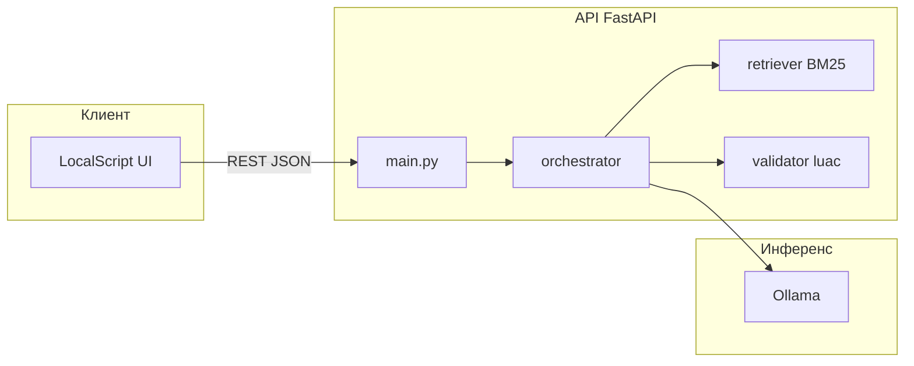

# Комплект для презентации: LocalScript (Lua + MWS Octapi)

Один файл со **всем нужным для защиты/презы**: тезисы по слайдам, архитектура, ML-контур, UI, финансы, метрики, демо.  
Актуально к коду репозитория; детали API см. [INFO.md](../INFO.md), жюри-пакет — [docs/jury/](jury/).

---

## 1. Как пользоваться

- **5 минут:** слайды 1–3 + 6 (архитектура) + 12 (метрики) + финансовый тезис (раздел 9).
- **10 минут:** + слайды 4–5, 7–8, демо по чеклисту (раздел 11).
- **Глубина:** разделы 6–8 для вопросов жюри по ML и инфраструктуре.

---

## 2. Elevator pitch (30 секунд)

**LocalScript** — локальный инженерный ассистент: из текста задачи и контекста Octapi получаете **проверенный Lua** для low-code. Работает в **Docker + Ollama**, без внешних облачных LLM. Качество держит **оркестратор**: уточнение запроса при нехватке контекста, **lexical RAG** (BM25 + ключевые слова), генерация, **`luac` + доменные правила**, при ошибке синтаксиса — **второй проход (reflexion)**. Сверху — веб-интерфейс **LocalScript** для чата, редактора и диагностики.

---

## 3. Слайды: готовые формулировки

### Слайд 1 — Заголовок

- **LocalScript: локальная генерация и проверка Lua для MWS Octapi**
- Подзаголовок: *Ollama в контуре организации · RAG · валидация · веб-интерфейс*

### Слайд 2 — Проблема

- Нужны короткие скрипты под контракт Octapi (`wf.vars`, `wf.initVariables`, утилиты).
- Ручное написание медленное; «голая» LLM даёт галлюцинации, неверный синтаксис, опасные паттерны.
- Корпоративный контур: **нельзя** отправлять код и промпты во внешние SaaS-LLM.

### Слайд 3 — Решение одной фразой

- **Локальная кодовая модель + знания из корпуса + жёсткая валидация + контролируемый второй проход.**

### Слайд 4 — Почему локально (безопасность и воспроизводимость)

- Данные и инференс в своих контейнерах; нет исходящих вызовов к OpenAI/Anthropic.
- Один старт: `docker compose up --build`; жюри может повторить eval с теми же env (freeze в README).

### Слайд 5 — Для кого продукт

- Инженеры сценариев Octapi / low-code.
- Команды, которым нужен **контролируемый** ассистент с проверяемым пайплайном, а не «чатик».

### Слайд 6 — Архитектура (см. также раздел 4 и диаграмму)

- Три уровня: **Ollama** (инференс) · **API FastAPI** (оркестрация, RAG, `luac`) · **статический UI** (браузер).
- Bootstrap: **ollama-pull** подтягивает веса до старта API.

### Слайд 7 — Модели

- **Основная:** `qwen2.5-coder:7b` — генерация и уточняющие вызовы.
- **Fallback:** `deepseek-coder:6.7b` — **только** при инфраструктурном сбое (таймаут, 5xx, `error` в JSON Ollama), не «замена логики» при плохом коде.

### Слайд 8 — ML / «умная» часть (не только модель)

- **Clarification-router:** при очень коротком запросе без доменных маркеров — отдельный вызов «достаточно ли контекста» → при необходимости `needs_clarification` + один уточняющий вопрос.
- **Retrieval:** Whoosh **BM25** + бонус по ключевым словам чанков; top‑k (freeze **4**); корпус `knowledge/chunks.jsonl`, опционально official, legacy `docs_snippets.json`.
- **Reflexion:** если после первого ответа `syntax_ok=false` — второй запрос к модели с полным отчётом валидатора.
- **Режимы:** новый скрипт (`POST /generate`), правка (`POST /edit`), только проверка (`POST /validate`).

### Слайд 9 — Валидация (доверие к выходу)

- **Lua 5.5** в образе (`luac`), доменные правила Octapi, запреты опасных вызовов (`os.execute`, `io.*`, …).
- В ответе: `validation`, при глубоком режиме — расширенная **diagnostics**.

### Слайд 10 — Результаты измерений (артефакты в репозитории)

| Набор | Результат (submission baseline) |
|--------|----------------------------------|
| **heavy_four strict** | `artifacts/eval_live/heavy_four_strict_after.json` → **4/4** success |
| **Полный strict eval** (18 кейсов) | `artifacts/eval_live/report_hackathon_strict_after.json` → **17 success + 1** ожидаемый `needs_clarification` |

- `transport_failed_case_ids = []`, `syntax_ok_rate = 1.0`, `fallback_used_count = 0` (см. README).

### Слайд 11 — Интерфейс (что показать глазами)

- **LocalScript:** шапка МТС, чат + редактор (настраиваемый сплит), режимы «новый скрипт / правка / проверка», «Быстро / Глубоко».
- Меню **«Платформа»** (⋯): тема, масштаб, шрифт кода, анимация полосы, история, вкладка справки.
- Полоска с **маскотом** (PNG по умолчанию), превью по ссылкам **`/cat`** и **`/media/cat_runner.png`** при запущенном API.
- Вкладки результата: сводка, валидация, пояснение, справка; при «Глубоко» — блок диагностики.

### Слайд 12 — Стек и воспроизводимость

- Python **FastAPI**, **httpx** → Ollama, **Whoosh** для индекса, **CodeMirror** в бандле `vendor` без CDN.
- Compose-профили: обычный, **hackathon** (`num_predict=256`), опционально **GPU**.

### Слайд 13 — Ограничения (честность перед жюри)

- Качество зависит от локальной модели и железа; таймауты и `num_predict` влияют на стабильность.
- RAG лексический, не векторный embeddings-store — осознанный trade-off: простота, отладка, контроль размера промпта.

### Слайд 14 — Заключение и ask

- End-to-end: **уточнение → RAG → LLM → извлечение ```lua → luac → [reflexion]**.
- Готовность к внедрению как **внутренний инструмент** контура; документация и метрики в репозитории.

---

## 4. Схема архитектуры

### 4.1 Блоки (логическая схема)

```
┌─────────────────────────────────────────────────────────────────┐
│                         Браузер пользователя                      │
│  LocalScript (static): чат · редактор · вкладки · настройки       │
└─────────────────────────────┬───────────────────────────────────┘
                               │ HTTP
┌──────────────────────────────▼──────────────────────────────────┐
│  api (FastAPI, main.py)                                           │
│  POST /generate  POST /edit  POST /validate                       │
│  GET /ready  GET /health  GET /retrieve/debug  GET /docs-snippets │
│  GET /cat  GET /media/cat_runner.png  + раздача static/           │
└──────────────────────────────┬───────────────────────────────────┘
                               │
        ┌──────────────────────┼──────────────────────┐
        ▼                      ▼                      ▼
┌───────────────┐    ┌─────────────────┐   ┌──────────────────┐
│ orchestrator  │    │ retriever.py    │   │ validator.py     │
│ clarify·RAG·  │───►│ BM25+keywords   │   │ luac + домен     │
│ Ollama·reflex │    │ knowledge/*.jsonl   │   │                  │
└───────┬───────┘    └─────────────────┘   └──────────────────┘
        │ HTTP
        ▼
┌───────────────┐     ┌────────────────┐
│    Ollama     │ ◄── │  ollama-pull   │  (однократно: pull моделей)
│  qwen / ds    │     └────────────────┘
└───────────────┘
```

### 4.2 Mermaid (можно вставить в Marp / Notion / Confluence)



---

## 5. Модели: что сказать устно

| Роль | Модель | Когда |
|------|--------|--------|
| Генерация / правка / reflexion | `qwen2.5-coder:7b` | Основной путь |
| Уточнение «YES/NO» | та же инфраструктура Ollama | Короткие запросы без доменных маркеров |
| Fallback | `deepseek-coder:6.7b` | Только сетевой/HTTP сбой к primary, не «исправление плохого Lua» |

Параметры инференса задаются в коде при вызове Ollama: `num_ctx`, `num_predict` из env (см. README, `docker-compose.hackathon.yml` для strict-профиля).

---

## 6. Фичи «в ML / AI» (для слайда «технологии»)

1. **Контролируемый оркестратор** — явные стадии, не хаотичный multi-agent.
2. **Lexical RAG** — Whoosh BM25 + keyword bonus, top‑k=4 (freeze), персистентный индекс (`WHOOSH_INDEX_DIR`).
3. **Clarification** — отдельный LLM-шаг только когда запрос короткий и без доменных якорей; edit-mode с кодом не блокируется лишним уточнением.
4. **Извлечение кода** — парсинг markdown ```lua из ответа модели.
5. **Reflexion** — второй проход с текстом ошибок валидатора при провале синтаксиса первого.
6. **Диагностика** — `include_diagnostics`, `retrieval_debug` (опционально env), итерации, модель, fallback-флаги.
7. **Офлайн-eval** — `tests/run_eval.py`, тяжёлые кейсы, артефакты в `artifacts/eval_live/`.

---

## 7. Фичи «в визуале / продукте»

| Область | Что показать |
|---------|----------------|
| Брендинг | Шапка МТС, акцентные цвета, понятные зоны «сценарий / работа с кодом / результат» |
| Рабочий стол | Чат + редактор, переключатель вида (оба / только чат / только редактор), запоминание сплита |
| Режимы | Новый скрипт · правка · проверка; глубина «Быстро / Глубоко» |
| Результат | Полоса сводки, вкладки (в т.ч. справка по API), блок использованных чанков |
| Настройки | Диалог «Платформа»: тема, масштаб, шрифт кода, анимация, история |
| Полоска | Опциональная анимация в полоске (настройки «Платформа»); превью ассета — `/cat`, `/media/cat_runner.png` |
| Справка | Вкладка «Справка»: краткие факты по UI и API, без лишних ссылок |

---

## 8. API и сервисы (кратко для слайда «интеграции»)

- **POST** `/generate`, `/edit`, `/validate` — основной контракт.
- **GET** `/ready` — готовность Ollama и моделей (503 если нет).
- **GET** `/health`, `/models`, `/retrieve/debug`, `/docs-snippets`.
- Статика: `/` → UI; отдельно превью маскота **`/cat`**, файл **`/media/cat_runner.png`**.

---

## 9. Слайд про финансовую выгоду (тезисы, без выдуманных цифр)

Используйте формулировки **эффект → механизм**; цифры ROI вставляйте только если есть внутренние данные заказчика.

1. **Снижение стоимости владения LLM в сценарии Octapi**  
   Нет подписок на внешние API для этого контура; основные затраты — **свои сервера** и электричество (или уже существующий кластер).

2. **Ускорение time-to-first-script**  
   Меньше времени на поиск примеров в документации за счёт **RAG** и готового каркаса кода в редакторе.

3. **Меньше переделок из-за ошибок до интеграции**  
   **luac + доменные правила + reflexion** снижают вероятность «сломали сценарий на проде из-за опечатки в Lua».

4. **Снижение рисков compliance**  
   Промпты и черновики кода **не уходят** во внешние облачные LLM — проще согласовать с ИБ.

5. **Предсказуемая нагрузка**  
   Один сервис API + один Ollama, лимиты `num_parallel`, измеренные eval — проще планировать capacity, чем «общий чат без лимитов».

6. **Окупаемость инженерного времени**  
   Меньше ручного копипаста типовых паттернов (`wf.vars`, init, массивы); фокус на бизнес-логике сценария.

*Фраза для слайда:* «Мы не обещаем магический ROI в процентах без замера на ваших кейсах; мы даём **контролируемый контур** с метриками на публичном наборе и прозрачными затратами на инфраструктуру.»

---

## 10. Конфигурация freeze (одна строка для жюри)

См. таблицу в **README.md**: `MODEL_NAME`, `FALLBACK_MODEL`, `RETRIEVAL_TOP_K=4`, `OLLAMA_NUM_PREDICT` (288 freeze / 256 hackathon), `OLLAMA_HTTP_TIMEOUT_S=240`, `OLLAMA_NUM_PARALLEL=1`, eval `--timeout 720`.

---

## 11. Чеклист демо (3–5 минут)

1. `docker compose up` (или уже поднятый стенд) → **GET /ready** = 200.
2. Открыть **`/`** — показать чат + редактор и переключатель режимов.
3. Короткая задача с `wf.vars` → сгенерировать → показать **валидацию** и при желании **retrieved chunks**.
4. «Платформа» — тема тёмная/светлая, при желании — полоска с котом; в новой вкладке **`/cat`**.
5. (Опционально) **POST /validate** на заведомо ошибочном фрагменте — подсветка редактора.

---

## 12. Где углубиться в репозитории

| Тема | Файл / папка |
|------|----------------|
| Архитектура и бенчмарк | [docs/jury/ARCHITECTURE_AND_BENCHMARK.md](jury/ARCHITECTURE_AND_BENCHMARK.md) |
| Полный обзор решения | [docs/jury/SOLUTION_FULL_OVERVIEW.md](jury/SOLUTION_FULL_OVERVIEW.md) |
| Слайды markdown (короткая версия) | [docs/jury/PRESENTATION.md](jury/PRESENTATION.md) |
| Сценарий демо | [docs/jury/DEMO_SCRIPT.md](jury/DEMO_SCRIPT.md) |
| Диаграммы | [docs/jury/DIAGRAMS.md](jury/DIAGRAMS.md) |
| Спека UI | [docs/jury/INTERFACE_SPEC.md](jury/INTERFACE_SPEC.md) |
| Список фич (EN) | [Features.md](../Features.md) |

---

## 13. Версия документа

Собрано как **единый презентационный kit** по состоянию репозитория; при изменении freeze или UI обновляйте разделы 10–11 и таблицу метрик на слайде 10.
